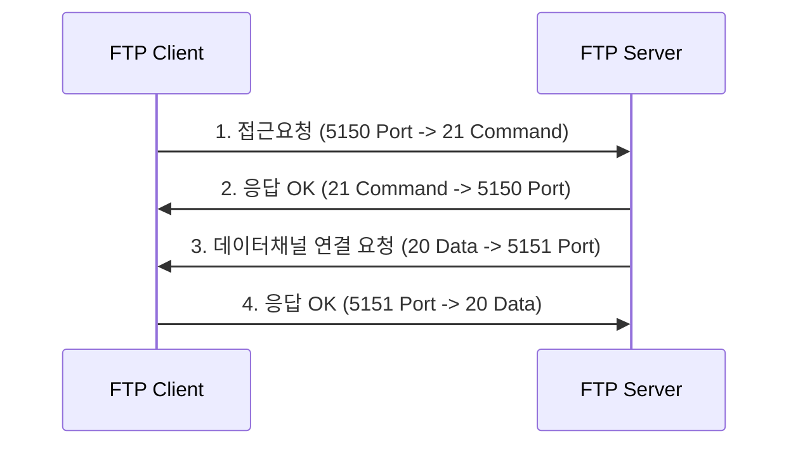
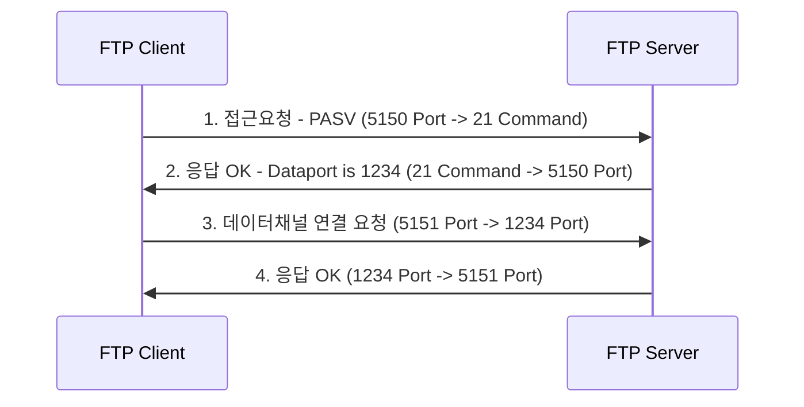

# FTP Active와 Passive의 차이
## FTP란 무엇인가
FTP는 **File Transfer Protocol**의 약자로 파일을 전송하는 통신 규약이다. FTP 서버에 파일들을 업로드, 다운로드할 수 있도록 해주는 프로토콜이며, 이는 FTP 서버와 FTP 클라이언트 간에 통신에서 이루어진다. 
 
FTP는 `Active 모드`와 `Passive 모드`라는 2개의 모드가 존재하며, 각각의 모드에서는 2개 또는 2개 이상의 포트가 연결을 맺고 데이터를 전송하는데 사용된다. 사용되는 포트는 연결을 제어하는 `Command 포트`와 데이터를 전송하는 `Data 포트`가 있다.
 
FTP는 TCP 기반으로 만들어져 있으며 기본 동작 모드로 `Active 모드`를 사용하며 20번 또는 1024번 이후의 데이터(Data) 포트는 데이터를 전송하는데 사용하고, 21번 포트는 접속 시에 사용되는 명령(Command) 포트이다.

---
### Active 모드
FTP Active 모드의 동작 방식을 그림으로 보면 아래와 같다. 참고로 아래 사용된 명령(Command) 포트와 데이터(Data) 포트는 서버의 설정에서 임의로 수정하여 사용 가능하다.

1. 클라이언트는 서버의 21번 포트로 접속한 후에 자신이 사용할 두 번째 포트를 서버에 미리 알려준다.
2.  서버는 클라이언트의 요청에 응답한다. (acks)
3. 서버의 20번 데이터 포트는 클라이언트가 알려준 두 번째 포트로의 접속을 시도한다.
4. 클라이언트가 서버의 요청에 응답한다. (acks)
 
위 과정에서 액티브 모드는 **클라이언트가 서버에 접속을 하는 것이 아닌 서버가 클라이언트에 접속하는 것**을 확인할 수 있다. 
 
만일 FTP 클라이언트에 방화벽이 설치되어 있는 등 외부에서의 접속을 허용하지 않는 상황이라면 FTP 접속이 정상적으로 이루어지지 않을 것이다. 접속이 되더라도 데이터 목록을 받아오지 못할 수도 있다.
 
 ### Passive 모드
 위에서 살펴본 Active 모드의 단점을 해결하기 위한 Passive 모드를 살펴보자. 아래 그림에서 사용된 커맨드 포트와 데이터 포트는 서버 설정에서 변경할 수 있다. 
  
 특히 Passive 모드에서는 데이터 포트 번호를 특별하게 지정하지 않는 경우 1024 ~ 65535 번 중에서 사용 가능한 임의 포트를 사용하게 된다. 포트 번호를 지정할 때는 10001 ~ 10005 번과 같이 범위 지정도 가능하다.

1. 클라이언트가 커맨드 포트로 접속을 시도한다. (Passive 모드 연결)
2. 서버에서는 사용할 두 번째 포트를 클라이언트에게 알려준다.
3. 클라이언트는 다른 포트를 열어 서버가 알려준 포트로 접속을 시도한다.
4. 서버가 클라이언트의 요청에 응답한다. (acks)

Passive 모드에서는 앞선 Active 모드에서 사용했던 20번 포트를 사용하지 않고 1024번 이후의 임의의 포트를 데이터 채널 포트로 사용하게 된다.

---
### 연결 방식에 따른 주의사항
* `Active 모드`의 경우, 클라이언트 측의 방화벽에 20번 포트가 차단되어 있다면, 데이터 채널 연결이 불가능하다. 연결은 되더라도 데이터 조회부터 실패되는 경우가 발생할 수 있다. 
	* 따라서 서버측은 20번 포트는 아웃바운드(OUTBOUND, 내 서버에서 외부서버로 보내는 요청) 허용, 클라이언트는 인바운드(INBOUND, 외부에서 내 서버로 들어오는 요청) 허용이 방화벽 설정에 필요하다.

 

* `Passive 모드`의 경우, 서버측의 데이터 채널 포트가 막혀있는 경우 데이터 채널 연결이 불가능하게 된다. 데이터 채널 포트의 범위는 지정할 수 있고, 별도로 지정하지 않는 경우는 1024 ~ 65535 번의 포트를 사용하게 된다.
	* 따라서 INBOUND 모두 허용이 필요하다. 서버 측에서 데이터 채널 포트 범위를 지정하여 특정 범위의 포트만 허용해주면 모든 포트 허용의 문제를 어느 정도 해결할 수 있다.

---
* 출처: https://madplay.github.io/post/ftp-active-passive 
