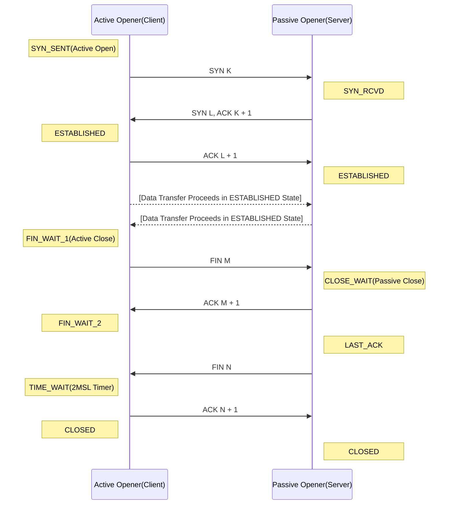

# TCP의 기능과 패킷 구조
TCP(Transmission Control Protocol)는 transport 계층의 대표적인 연결지향 프로토콜이다. TCP는 기본적으로 하위계층에서의(network, datalink 계층) 패킷 손실, 중복, 오류 등 모든 전송 문제를 검출하고 해결한다.

</br>

TCP의 연결이 설정되고 통신하는 동안 두 종단 사이에는 다수의 옵션이 교환된다. 때문에 UDP에 비해 기능과 역할이 매우 복잡하고 다양하지만 신뢰성 있는 통신이 가능하다.

---

### TCP 헤더
* Source Port: 패킷을 송신하는 시스템의 포트 번호를 나타낸다. 클라이언트의 경우 예약된 0 ~ 1023의 well-known 포트 번호를 제외한 번호를 임의로 생성하고, 서버의 경우 일반적인 서비스 제공 시 well-known한 포트를 사용한다.
	* 예) HTTP(80), FTP(20, 21)
* Destination Port: 패킷을 수신할 시스템의 포트 번호를 나타낸다.
* Sequence Number: 세그먼트(각 계층 패킷의 구분을 위해 4계층-세그먼트, 3계층-패킷, 2계층-프레임으로 구분) 데이터의 순서 번호를 표기한다.
	* 3Way-Handshaking 수행 시, ISN(Initial Sequence Number)의 기능도 한다. 
	* RFC1122에 따르면, 시스템의 클럭에서 추출된 값을 부여한다. 
	* Sequence Number는 Acknowledge Number와 함께 통신의 신뢰성을 보장한다.
* Acknowledge Number: 상대방으로부터 수신한 데이터의 바로 다음에 수신할 데이터 순서 번호를 나타낸다. Sequence Number의 확인 응답으로서 데이터 전송자에게 패킷을 잘 받았으니 그 다음 패킷을 송신하라는 의미로 사용된다. 상대방이 다음에 전송할 패킷의 Sequence Number이기도 하다.
* Header Length(Data Offset): TCP 헤더의 길이 값을 정의한다. 일반적으로 TCP 헤더의 길이는 20 Byte이며, TCP 헤더 길이를 확장할 경우 4 Byte씩 증가한다.
* Reserved: 미래를 위해 예약된 필드로 항상 0으로 설정한다.
* Flags
	* CWR: 송신자가 자신의 윈도우 사이즈를 줄인다.
	* ECE: 혼잡 감지 시 수신자가 ECE를 설정하여 송신자에게 알린다.
	* URG: Urgent Point 필드와 함께 사용되고 플래그 설정 시 TCP는 해당 세그먼트를 전송 큐의 제일 앞으로 보낸다.
	* ACK: SYN에 대한 확인의 의미이다. 3Way-Handshacking에서의 SYN과 reset을 제외하고 모든 세그먼트에 ACK가 설정된다.
	* PSH: 일반적으로 모든 데이터를 전송하고 마지막에 보내는 신호로 수신 측은 데이터를 즉시 전송하라는 의미이다.
	* RST: 송신자가 유효하지 않은 연결을 시도할 때 거부하는데 이용되고, 또한 통신의 연결 및 종료를 정상적으로 할 수 없을 때 사용된다.
	* SYN: 통신 시작 시 연결을 요청하고 ISN을 교환한다.
	* FIN: 데이터 전송을 종료한다. 
* Window Size: 송신 시스템에서 자신이 수용하는 한 버퍼의 크기를 Byte 단위로 나타낸다. 통신하는 동안 송수신자는 해당 필드를 통해 수신 사이즈를 계속 변경한다.
* Checksum: 데이터가 전송 중에 손실되지 않고 원본과 동일한 지 검사한다.
* Urgent Point: Urgent flag 설정 시, urgent 데이터의 마지막 byte의 일련번호를 Urgent Point 필드에 저장한다. 해당 부분까지 긴급하게 처리를 요한다는 의미이다.

---

### TCP 연결 과정
TCP 연결은 두 개의 IP와 두 개의 포트 번호를 통해 이루어진다. 각 종단점은 한 개의 IP, 한 개의 포트번호 쌍을 가지고 TCP 통신에 임한다. 일반적으로 연결은 `준비 - 데이터 전송 - 종료`의 3단계로 이루어진다. TCP 통신을 요청하는 쪽은 `Active Opener(Client)`, 통신의 상대편을 `Passive Opener(Server)`라 칭한다. 

</br>

* <그림 1> 연결 준비 및 종료 절차


위의 <그림 1>에서 `Connection set-up`은 흔히 3Way-Handshacking 이라 부르는 과정으로 클라이언트와 서버 간 세션을 성립하는 단계이다.

</br>

1. Client는 Server로 부터 원하는 서비스(ex. 80 HTTP)의 포트 번호에 Client의 ISN 값을 Sequence Number에 설정하고 SYN 패킷을 보낸다.
2. Server는 자신의 ISN을 Sequence Number에 설정하여 SYN 패킷과 순서 1에 대한 응답으로 ISN(Client) + 1 값을 Acknowledge Number에 설정하여 전송한다.
3. Client는 순서 2의 SYN에 대한 응답으로 ISN(Server) + 1 값으로 Acknowledge Number를 설정하여 전송한다. 이 때 Sequence Number의 값은 순서 1의 ISN(Client) + 1 로 설정되는데, 이는 순서 2의 Acknowledge Number와 동일하다.


 ```
[3Way-Handshacking Sample] 

 8428 > http [SYN] Seq=343143064 win=65535 ...
 http > 8428 [SYN, ACK] Seq=584361652 Ack=343143065 win=8190 ...
 8428 > http [ACK] Seq=343143065 Ack=584361653 win=65536 ...
```
<그림 1>의 Connection close는 통신의 종료 과정으로 `4Way-Handshacking`, `4Release`로도 불린다. 종료는 일반적으로 Client가 시작하는 것이 보통이지만 Server가 종료를 시작 할 수도 있고, 드물지만 동시에 종료하는 경우도 존재한다.
1. Client는 Server가 받기를 기대하는(종료 하기 전 마지막 패킷의 Acknowledge Number)를 Sequence Number로 설정하고 (그림의 K), 마지막 패킷의 Sequence Number를 Acknowledge Number로 설정하여 (그림의 L) FIN과 바로 전 패킷에 대한 응답으로 ACK를 함께 전송한다. 
2. Server는 Client가 보낸 FIN에 응답하기 위해 K + 1 값을 Acknowledge Number로 설정하고 ACK 패킷을 전송한다.
3. 순서 2의 진행 후 Server의 애플리케이션이 내부적으로 종료 절차를 진행하면서 FIN을 전송한다. 순서 4의 ACK를 수신하지 못한 경우 수신할 때 까지 FIN을 재전송한다.
4. Client는 Server의 FIN에 대한 응답으로 L + 1 값을 Acknowledge Number에 설정하고 ACK 패킷을 전송한다.
 
 ```
[4Way-Handshacking Sample] 

55989 > 63111 [FIN, ACK] Seq=2564768963 Ack=2448526260 ...
63111 > 55989 [ACK] Seq=2448526260 Ack=2564768964 ...
63111 > 55989 [FIN, ACK] Seq=2448526260 Ack=2564768964
55989 > 63111 [ACK] Seq=2564768964 Ack=2448526261 ...
```

---

### 3Way-Handshacking과 4 Release의 상태 변화 정리



---

* 출처: https://mr-zero.tistory.com/36?category=439699 
