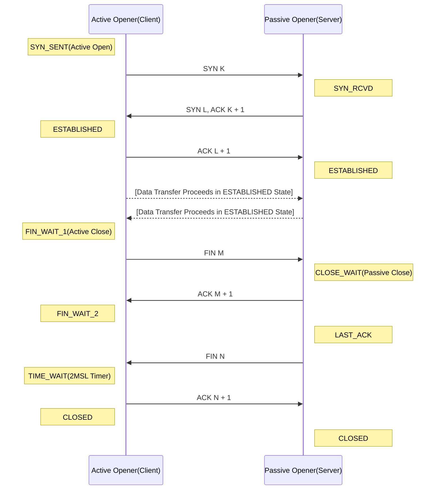

2. Server는 Client가 보낸 FIN에 응답하기 위해 K + 1 값을 Acknowledge Number로 설정하고 ACK 패킷을 전송한다.
3. 순서 2의 진행 후 Server의 애플리케이션이 내부적으로 종료 절차를 진행하면서 FIN을 전송한다. 순서 4의 ACK를 수신하지 못한 경우 수신할 때 까지 FIN을 재전송한다.
4. Client는 Server의 FIN에 대한 응답으로 L + 1 값을 Acknowledge Number에 설정하고 ACK 패킷을 전송한다.
 
 ```
[4Way-Handshacking Sample] 

55989 > 63111 [FIN, ACK] Seq=2564768963 Ack=2448526260 ...
63111 > 55989 [ACK] Seq=2448526260 Ack=2564768964 ...
63111 > 55989 [FIN, ACK] Seq=2448526260 Ack=2564768964
55989 > 63111 [ACK] Seq=2564768964 Ack=2448526261 ...
```

---

### 3Way-Handshacking과 4 Release의 상태 변화 정리



---

* 출처: https://mr-zero.tistory.com/36?category=439699
